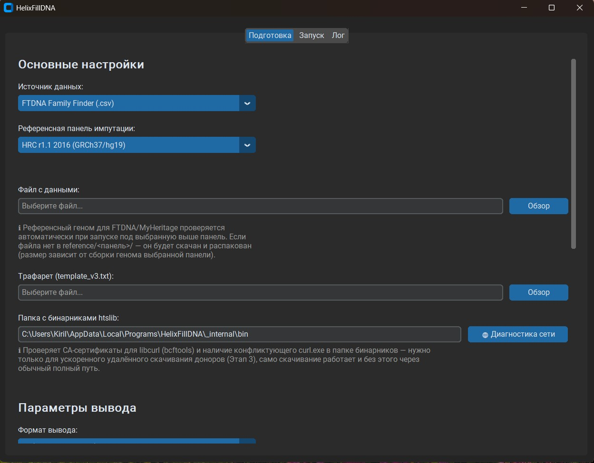
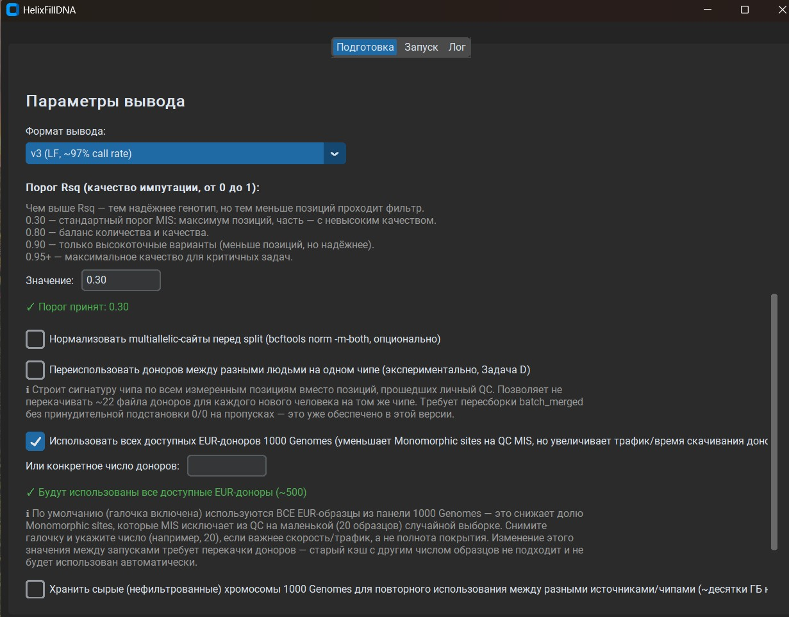
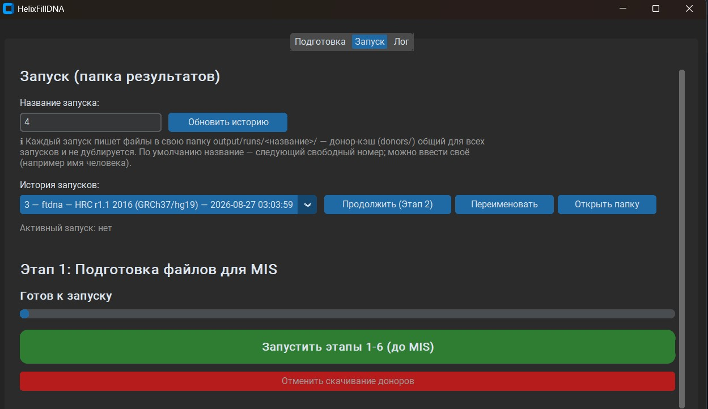
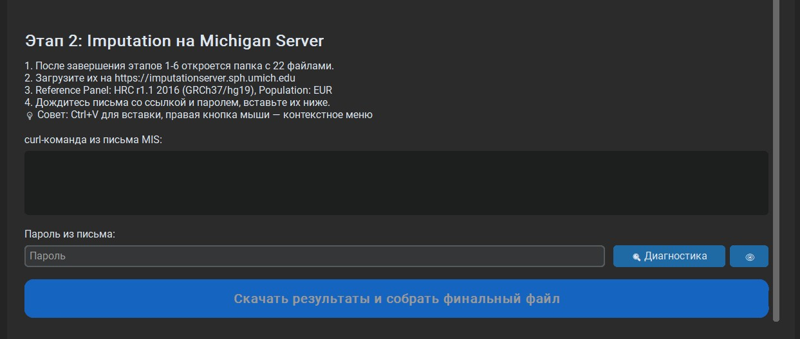

  <h1 style="display:flex; align-items:center; justify-content:center; gap:0.6rem;">
    
    HelixFillDNA
  </h1>
  

    Конвертирует сырые данные ДНК (FTDNA, MyHeritage или готовый VCF)
    в формат 23andMe — для импутации и последующей загрузки в Генотек.
  

  <a class="btn-download"
     href="https://github.com/{{ site.repository }}/releases/latest">
    ⬇ Скачать последнюю версию
  </a>
  
<small>Windows 10+, 64-бит. Установщик не требует прав администратора.</small>

<figure style="margin:1.5rem 0; text-align:center;">
  
  <figcaption style="color:#777; font-size:0.9rem; margin-top:0.4rem;">
    Вкладка «Подготовка» — выбор источника данных (FTDNA/MyHeritage/VCF), референсной панели импутации и нужных файлов.
  </figcaption>
</figure>

<figure style="margin:1.5rem 0; text-align:center;">
  
  <figcaption style="color:#777; font-size:0.9rem; margin-top:0.4rem;">
    Там же — настройка формата вывода, порога качества импутации (Rsq) и параметров донорской панели.
  </figcaption>
</figure>

<figure style="margin:1.5rem 0; text-align:center;">
  
  <figcaption style="color:#777; font-size:0.9rem; margin-top:0.4rem;">
    Вкладка «Запуск» — история предыдущих запусков и кнопка запуска этапов 1-6 (подготовка файлов для загрузки на сервер импутации).
  </figcaption>
</figure>

<figure style="margin:1.5rem 0; text-align:center;">
  
  <figcaption style="color:#777; font-size:0.9rem; margin-top:0.4rem;">
    Этап 2 — вставьте curl-команду и пароль из письма Michigan Imputation Server, чтобы скачать результаты и собрать финальный файл.
  </figcaption>
</figure>

## Зачем это нужно

FTDNA и Генотек используют разные чипы — наборы позиций ДНК, которые
они читают. Пересечение между ними — около 49%, а Генотек требует не
меньше 85%, поэтому сырой файл FTDNA он отклоняет напрямую.

HelixFillDNA автоматизирует весь процесс — импутацию (статистическое
восстановление недостающих позиций) и сборку итогового файла по
трафарету — вместо ручного набора команд в Linux/WSL.

## Как начать

<ol class="steps">
  <li>
    <strong>Скачайте установщик</strong> из
    <a href="https://github.com/{{ site.repository }}/releases/latest">GitHub Releases</a>
    и запустите его — права администратора не нужны.
  </li>
  <li>
    <strong>Подготовьте два файла</strong>: ваш сырой экспорт
    (FTDNA/MyHeritage/VCF) и трафарет — экспорт 23andMe, который
    Генотек уже принимал у кого-либо ранее.
  </li>
  <li>
    <strong>Запустите конвертацию</strong> в приложении и загрузите
    готовый файл в Генотек. Полный процесс занимает около двух часов
    (в основном — ожидание закачек), повторный запуск для следующего
    теста — около 20 минут.
  </li>
</ol>

## FAQ

**Безопасно ли это для генетических данных?**
Да. Приложение не передаёт ваши генетические данные разработчику и не
хранит их за пределами вашего устройства. Загрузка на сервер импутации
(Michigan Imputation Server для панели HRC, TOPMed Imputation Server /
BioData Catalyst для панели TOPMed) выполняется напрямую с вашего
компьютера, под вашей собственной учётной записью на этих сервисах.
Подробности — в [политике конфиденциальности](#privacy).

**Нужен ли Python?**
Нет, если вы используете готовый установщик — все зависимости уже
внутри. Python нужен только при запуске из исходного кода.

**Сколько это занимает по времени?**
Первый запуск для нового чипа — около двух часов, из которых
полтора часа — ожидание закачек референсного генома и донорских
образцов (эти файлы скачиваются один раз и переиспользуются дальше).
Повторный запуск для следующего теста на том же чипе — около 20 минут.

## Политика конфиденциальности

Полный текст — в файле
[PRIVACY.md](https://github.com/{{ site.repository }}/blob/main/PRIVACY.md)
в репозитории проекта.

---

<small>
© 2026 Поломошнов Кирилл Сергеевич ·
<a href="https://github.com/{{ site.repository }}/blob/main/EULA.md">EULA</a> ·
<a href="https://github.com/{{ site.repository }}/blob/main/LICENSE">Лицензия исходного кода</a> ·
<a href="https://github.com/{{ site.repository }}">Репозиторий на GitHub</a>
</small>

