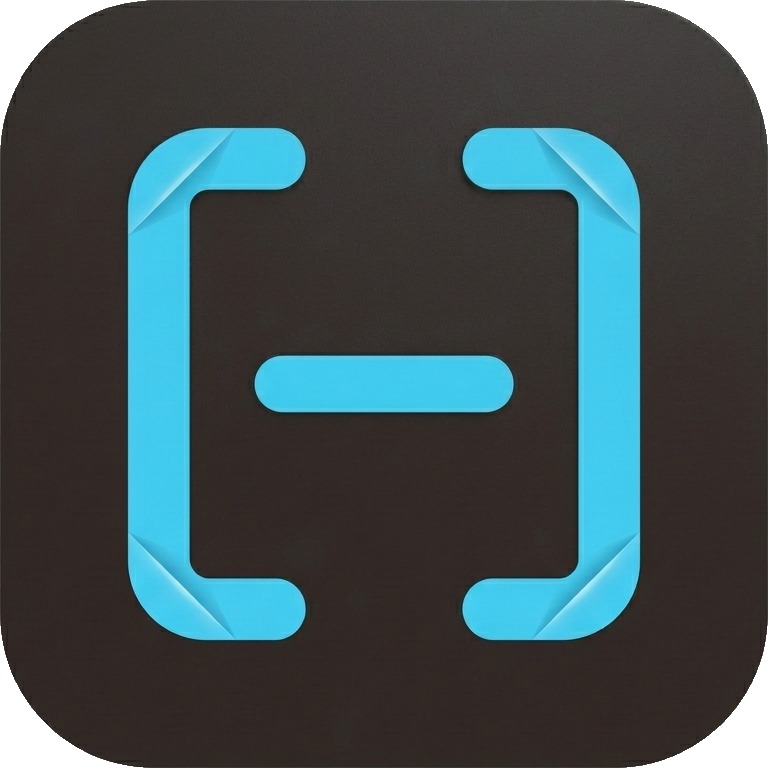
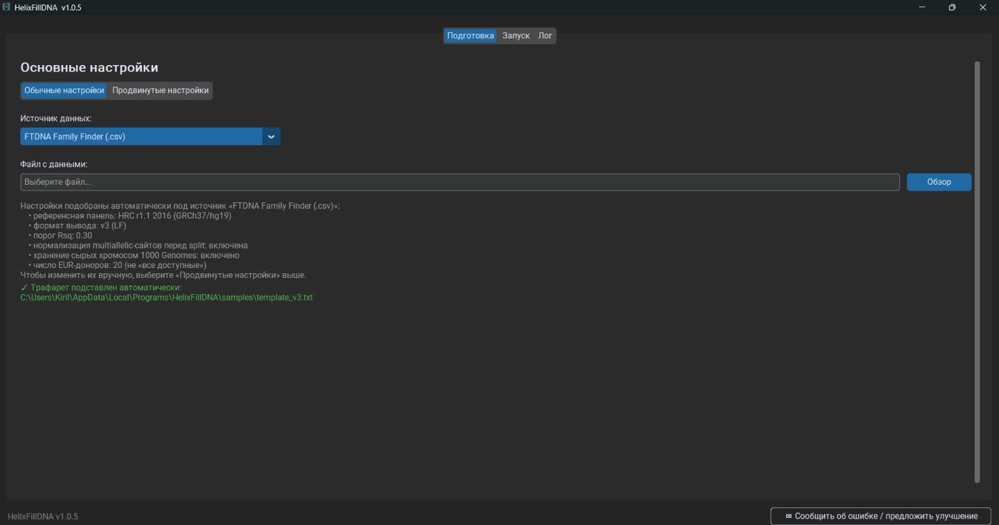
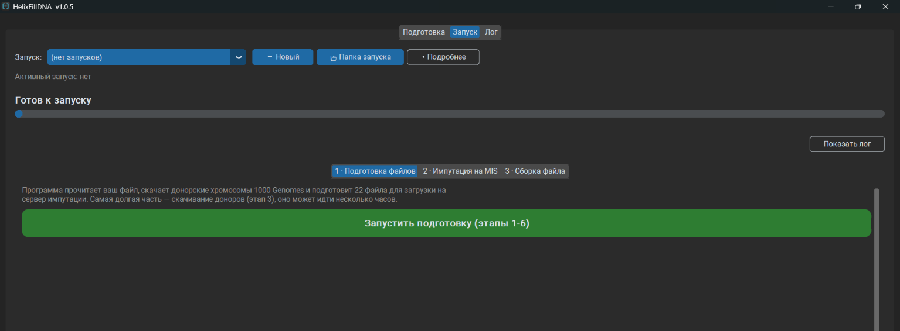
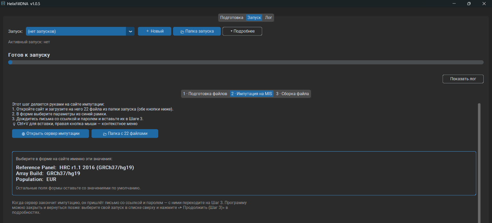
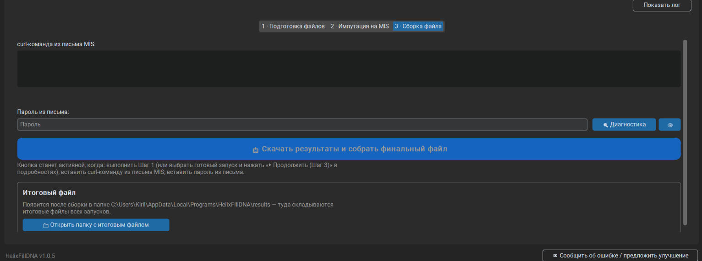

  <h1 style="display:flex; align-items:center; justify-content:center; gap:0.6rem;">
    
    HelixFillDNA
  </h1>
  

    Конвертирует сырые данные ДНК (FTDNA, MyHeritage, AncestryDNA или
    готовый VCF) в формат 23andMe — для импутации и последующей загрузки
    в Генотек.
  

  <a class="btn-download"
     href="https://github.com/{{ site.repository }}/releases/latest">
    ⬇ Скачать последнюю версию
  </a>
  
<small>Windows 10+, 64-бит. Установщик не требует прав администратора.</small>

<figure style="margin:1.5rem 0; text-align:center;">
  
  <figcaption style="color:#777; font-size:0.9rem; margin-top:0.4rem;">
    Вкладка «Подготовка» в обычном режиме — указать нужно только источник данных и свой файл.
    Формат вывода, референсную панель, порог качества и трафарет программа подбирает сама
    и показывает, что именно выбрала. Кому нужно — есть продвинутый режим, где всё правится вручную.
  </figcaption>
</figure>

<figure style="margin:1.5rem 0; text-align:center;">
  
  <figcaption style="color:#777; font-size:0.9rem; margin-top:0.4rem;">
    Шаг 1 — программа читает ваш файл, скачивает донорские хромосомы и готовит 22 файла
    для сервера импутации. По ходу видно, какая хромосома качается, сколько мегабайт уже
    на диске и с какой скоростью.
  </figcaption>
</figure>

<figure style="margin:1.5rem 0; text-align:center;">
  
  <figcaption style="color:#777; font-size:0.9rem; margin-top:0.4rem;">
    Шаг 2 — единственная ручная часть. Кнопки открывают сам сервер импутации и папку
    с готовыми файлами, а параметры, которые нужно выбрать в форме, вынесены в отдельную
    рамку: ошибка в них стоит нескольких часов.
  </figcaption>
</figure>

<figure style="margin:1.5rem 0; text-align:center;">
  
  <figcaption style="color:#777; font-size:0.9rem; margin-top:0.4rem;">
    Шаг 3 — вставьте ссылку и пароль из письма сервера. Программа скачает результаты
    и соберёт итоговый файл в отдельную папку, откуда его можно загружать в Генотек.
  </figcaption>
</figure>

## Зачем это нужно

FTDNA и Генотек используют разные чипы — наборы позиций ДНК, которые
они читают. Пересечение между ними — около 49%, а Генотек требует не
меньше 85%, поэтому сырой файл FTDNA он отклоняет напрямую.

HelixFillDNA автоматизирует весь процесс — импутацию (статистическое
восстановление недостающих позиций) и сборку итогового файла по
трафарету — вместо ручного набора команд в Linux/WSL.

## Как начать

<ol class="steps">
  <li>
    <strong>Скачайте установщик</strong> из
    <a href="https://github.com/{{ site.repository }}/releases/latest">GitHub Releases</a>
    и запустите его — права администратора не нужны.
  </li>
  <li>
    <strong>Выберите свой файл</strong> — сырой экспорт FTDNA, MyHeritage,
    AncestryDNA или готовый VCF. Трафарет (образец экспорта 23andMe, по которому
    собирается итоговый файл) искать не нужно: оба формата входят
    в установщик и подставляются автоматически.
  </li>
  <li>
    <strong>Пройдите три шага</strong> — программа готовит файлы, вы
    загружаете их на сервер импутации и ждёте письма, программа
    скачивает результаты и собирает итоговый файл. Первый запуск занимает
    около двух часов, в основном это ожидание закачек; повторный для
    следующего теста на том же чипе — около 20 минут.
  </li>
</ol>

## FAQ

**Безопасно ли это для генетических данных?**
Да. Приложение не передаёт ваши генетические данные разработчику и не
хранит их за пределами вашего устройства. Загрузка на сервер импутации
(Michigan Imputation Server для панели HRC, TOPMed Imputation Server /
BioData Catalyst для панели TOPMed) выполняется напрямую с вашего
компьютера, под вашей собственной учётной записью на этих сервисах.
Подробности — в [политике конфиденциальности](#privacy).

**Нужен ли Python?**
Нет, если вы используете готовый установщик — все зависимости уже
внутри. Python нужен только при запуске из исходного кода.

**Сколько места нужно на диске?**
Не меньше 20 ГБ. Около 3 ГБ занимает референсный геном, остальное —
донорские образцы 1000 Genomes и временные файлы. По умолчанию включено
хранение сырых хромосом (экономит трафик при повторных запусках) — это
добавляет ещё 13–20 ГБ; если места мало, отключите его в продвинутом
режиме настроек.

**Windows ругается на установщик — это нормально?**
Да. Установщик не подписан цифровым сертификатом, поэтому SmartScreen
показывает «Система Windows защитила ваш компьютер» — нажмите
«Подробнее» → «Выполнить в любом случае». Если включён Smart App Control,
он блокирует установку совсем; тогда остаётся собрать программу из
исходников. Подробности — в
[README](https://github.com/{{ site.repository }}#предупреждение-windows-при-запуске-установщика).
Сертификат для подписи стоит денег и требует проверки личности — для
бесплатного проекта одного разработчика это пока не окупается, а
исходный код открыт и его можно прочитать.

**Сколько это занимает по времени?**
Первый запуск для нового чипа — около двух часов, из которых
полтора часа — ожидание закачек референсного генома и донорских
образцов (эти файлы скачиваются один раз и переиспользуются дальше).
Повторный запуск для следующего теста на том же чипе — около 20 минут.

## Политика конфиденциальности

Полный текст — в файле
[PRIVACY.md](https://github.com/{{ site.repository }}/blob/main/PRIVACY.md)
в репозитории проекта.

---

<small>
© 2026 Поломошнов Кирилл Сергеевич ·
<a href="https://github.com/{{ site.repository }}/blob/main/EULA.md">EULA</a> ·
<a href="https://github.com/{{ site.repository }}/blob/main/LICENSE">Лицензия исходного кода</a> ·
<a href="https://github.com/{{ site.repository }}/blob/main/CHANGELOG.md">История изменений</a> ·
<a href="https://github.com/{{ site.repository }}">Репозиторий на GitHub</a>
</small>

